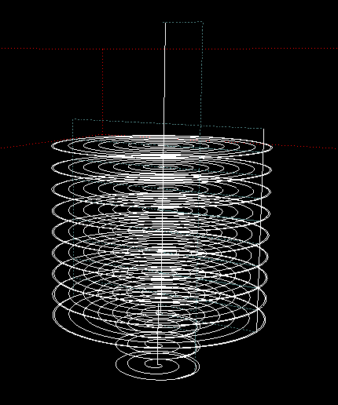
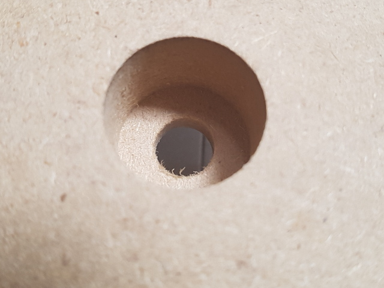
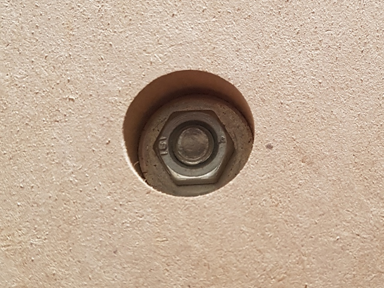

# Mounting hole

Made for MDF spoilboard 270x350x22 fixed with M8x16 bolt M8 nut and Ø22mm washer.

Carved with a 2 flute cylindrical cutter Ø2mm at 600mm/m 24krpm on a 3040

Due to the thickness of the spoilboard and the depth of the cut, make sure the cutter has a **minimum CEL of 17mm**

